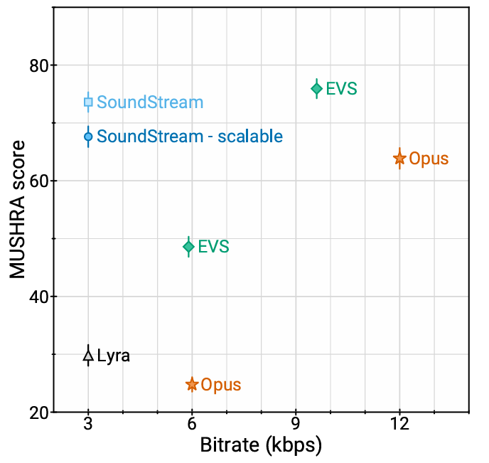
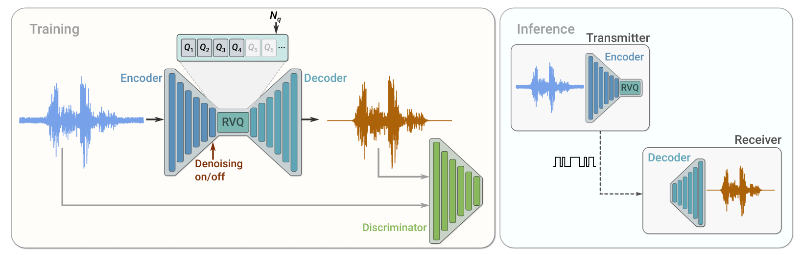

## Soundstream[<svg xmlns="http://www.w3.org/2000/svg" enable-background="new 0 0 24 24" height="24px" viewBox="2 -5 24 24" width="24px" fill="#4B77D1"><g><rect fill="none" height="24" width="24"/></g><g><polygon points="6,6 6,8 14.59,8 5,17.59 6.41,19 16,9.41 16,18 18,18 18,6"/></g></svg>](https://arxiv.org/abs/2107.03312)

### 概述

基于**神经网络**的音频编码器，高效压缩语音、音乐和一般音频。

模型结构由**全卷积编码器/解码器网络**和**残差矢量量化器**组成。

结合了**对抗和重建损失(GAN)**技术，可将量化的嵌入作为输入，生成高质量音频。

单模型生成3kbps~18kpbs的音频，适用于低延迟实现，支持流式推理，并可在智能手机 CPU 上实时运行。

### 模型结构

### 核心算法

## Encodec[<svg xmlns="http://www.w3.org/2000/svg" enable-background="new 0 0 24 24" height="24px" viewBox="2 -5 24 24" width="24px" fill="#4B77D1"><g><rect fill="none" height="24" width="24"/></g><g><polygon points="6,6 6,8 14.59,8 5,17.59 6.41,19 16,9.41 16,18 18,18 18,6"/></g></svg>](https://arxiv.org/abs/2210.13438)

## Wavtokenizer[ICLR 2025][<svg xmlns="http://www.w3.org/2000/svg" enable-background="new 0 0 24 24" height="24px" viewBox="2 -5 24 24" width="24px" fill="#4B77D1"><g><rect fill="none" height="24" width="24"/></g><g><polygon points="6,6 6,8 14.59,8 5,17.59 6.41,19 16,9.41 16,18 18,18 18,6"/></g></svg>](https://arxiv.org/abs/2408.16532)

