[前置论文Flamingo解读](https://zhuanlan.zhihu.com/p/685233706)

## Audio Flamingo V1[<svg xmlns="http://www.w3.org/2000/svg" enable-background="new 0 0 24 24" height="24px" viewBox="2 -5 24 24" width="24px" fill="#4B77D1"><g><rect fill="none" height="24" width="24"/></g><g><polygon points="6,6 6,8 14.59,8 5,17.59 6.41,19 16,9.41 16,18 18,18 18,6"/></g></svg>](https://arxiv.org/abs/2402.01831)

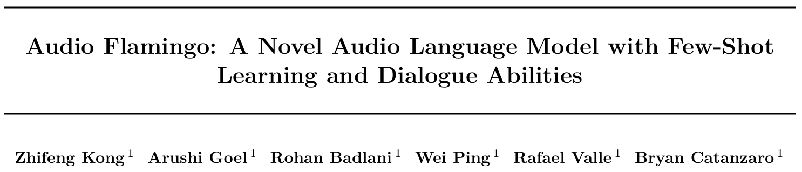

### 概述

`Audio Flamingo`是一种音频语言模型，旨在增强大型语言模型（LLMs）对音频的理解能力，包括**非语音声音**和**非言语语音**。

该模型具有以下核心特点：
* **强大的音频理解能力**：能够处理多种音频任务，如音频字幕`CAP`、音频问答`AQA`和音频分类`CLS`。
* **少样本学习能力**：通过上下文学习`ICL`和检索增强生成`RAG`快速适应新任务，无需微调。
* **多轮对话能力**：支持复杂的多轮对话，能够理解上下文并生成连贯的回复。

`Audio Flamingo`在参数量仅为其他模型（例如`Qwen-audio`）的1/3的情况下实现了相似性能。

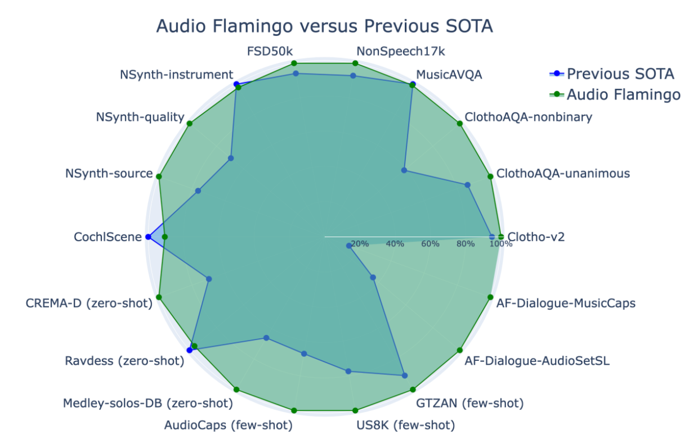

解决的核心问题：
* **从变长音频中提取特征，并对`LM`进行音频特征的调整**：引入了一种基于Elizalde等人(2023b)的滑动窗口音频特征提取器，能更好地捕捉时间信息。对于将音频`token`输入到`LM`中，先前模型在音频`token`前后添加了特殊标记（例如`Qwen-audio`的`<|audio_bos|>`和`<|audio_eos|>`标记）并将其混合到文本`token`中。这种方法对于长音频可能会有过高的开销，因为其复杂性与音频标记的数量呈二次方关系。相比之下，作者使用**交叉注意力**将音频输入融合到`LM`中，类似于 `Flamingo`(Alayrac 等人，2022)。这种方式的复杂性与音频`token`的数量呈线性关系。
* **数据集与训练**。作者整理了一个包含约590万个音频-文本对的混合数据集。作者采用了一种基于广泛采用且稳定的方法来训练`LLMs`(Ouyang 等，2022)，具体分为两个训练阶段：预训练和监督微调，每个阶段都有不同的子集和训练技术。
* **赋予音频语言模型无需微调快速适应新任务的能力**：作者实现了一种高效的检索方法，引入了`ICL`模板，并使用检索到的样本创建交错`ICL`数据集进行训练。此外，作者还引入了一种新颖的**交错样本交叉注意力掩码**。
* **赋予音频语言模型与用户进行多轮对话的能力**。作者创建了两个基于`GPT-4`的多轮对话数据集，通过在这些数据集上微调`Audio Flamingo`来获得一个聊天模型。

[代码仓库](https://github.com/NVIDIA/audio-flamingo/) & [演示Demo](https://audioflamingo.github.io/)

### 模型架构

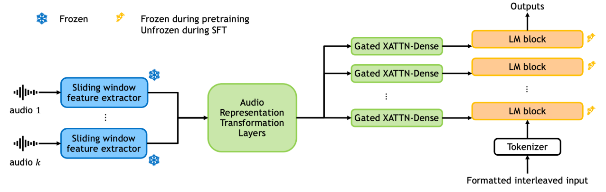

Audio Flamingo 的架构包含四个主要组件：
- **音频特征提取器**：使用`ClapCap`（Elizalde 等，2023b）作为音频特征提取器的主干。`ClapCap`被硬编码为以7秒的44.1kHz原始音频作为输入，然后将音频转换为跳长为320、窗口长度为1024、64维的Mel频谱图，最后输出**一个**1024维度的向量表示。每7秒的片段视为一个窗口，并使用滑动窗口从较长的音频中提取特征，连续窗口之间的重叠为`7×0.75=5.25`秒。这种设计的直觉是为了捕捉在单个融合表示向量中可能被忽略的长距离和时间信息。使用最多 16 个滑动窗口，因此支持最多33.25秒的音频长度。*批量训练时不足的滑动窗口将被填充，超出的滑动窗口将被裁剪，每个音频生成16个token*
- **音频表示转换层**：通过进一步应用几个音频表示变换层于来增加模型容量。音频表示变换层由3个自注意力层组成，每个层有8个头和2048的潜在维度。此模块是可训练的。
- **语言模型**：使用OPT-IML-MAX-1.3B作为解码器，这是一个具有1.3B参数和24个LM块的模型。它已在许多自然语言任务上进行指令微调。
- **条件融合层**：通过交叉注意力将音频输入与语言模型融合。使用`Flamingo`（Alayrac 等，2022）中的`gated xattn-dense`层来实现对音频输入的条件化。每一层包含两个模块：一个带有交叉注意力和`tanh`门控的残差块和一个带有密集层和`tanh`门控的残差块。这些层被添加到每个`LM`模块之前。

### 核心算法

#### 数据集

作者将音频数据分为通用音频(场景音等)、音乐和语音，将数据集分为三种类型的任务：
* 音频字幕（CAP）——希望模型用一句话描述音频；
* 音频问答（AQA）——希望模型回答有关音频的问题；
* 音频分类（CLS）——希望模型将声音分类为与事件、场景、音乐流派、乐器、品质等相对应的一个或多个标签。

以下是作者用到的所有数据集

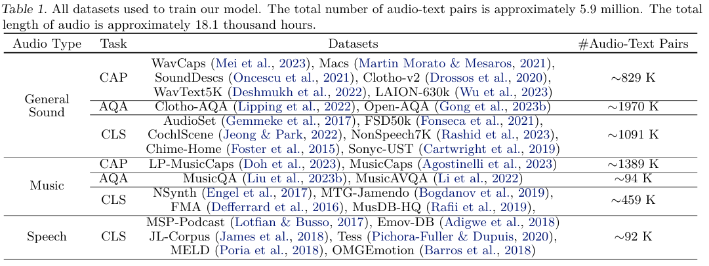

#### 单一样本训练

对于每一个数据集中的每个单一样本，作者构建对话模板如下：（Options仅出现在音频分类样本中）

```markdown
<s>{task description}<audio>{instruction}
[Options:\n- option-1\n···- option-m]
<SEP>{output}<EOC></s>
```

使用最大似然估计（MLE）来训练模型，损失定义为：

$$
\mathcal{L}(\mathbf{z}) = \sum_{t=1}^{|\mathbf{y}_{\text{out}}|} \log p_{\theta} \left( (\mathbf{y}_{\text{out}})_t \mid \mathbf{x}, \mathbf{y}_{\text{ins}}, (\mathbf{y}_{\text{out}})_{<t} \right).
$$

其中：
* $\mathbf{x}$ 为单通道音频，$\mathbf{y}\_{\text{ins}}$ 为指令文本，$\mathbf{y}\_{\text{out}}$ 为输出文本
* $\mathbf{z} = (\mathbf{x}, \mathbf{y}\_{\text{ins}}, \mathbf{y}\_{\text{out}})$ 表示一个单一样本
* $(\mathbf{y}\_{\text{out}})\_{t}$ 为第 t个`token`，$(\mathbf{y}\_{\text{out}})\_{<t}$ 为前t-1个`token`

#### 交错样本构建与训练

交错样本构建是`ICL`的基础，也是模型`RAG`能力的来源。

作者基于**音频嵌入**的$k$-NN计算为每个原始数据集构建`ICL`数据集。

设$\mathcal{D}^i$为第i个训练数据集。对于每个$\mathbf{z} = (x, y_{\text{ins}}, y_{\text{out}}) \in \mathcal{D}^i$，在$\mathcal{D}^i$中找到其最接近的k个训练样本（除 $\mathbf{z}$本身），其中距离函数定义为样本的音频部分在`fused LAION-CLAP`嵌入空间（Wu 等人，2023）中的L2范数。作者使用`Faiss-gpu`（Johnson 等人，2019）来加速搜索。整体过程入下所示：

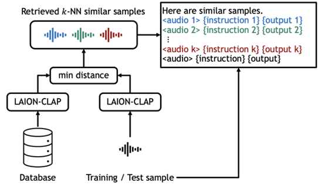

对于交错样本，作者构建对话模板如下：（Options仅出现在音频分类样本中）

```markdown
<s>{task description}Here are similar samples.
<audio>{instruction-1}<SEP>{output-1}<EOC>
· · ·
<audio>{instruction-k}<SEP>{output-k}<EOC>
<audio>{instruction}
Options:\n- option-1\n···- option-m
<SEP>{output}<EOC></s>
```

对于交错样本的交叉注意力计算，作者设计了一种**交叉注意力掩码**（类似`Flamingo`的做法）。

对于交错样本，作者使用块上三角交叉注意力掩码，以便第$j$个输出$P_{\theta}(y^j_{\mathrm{out}})$的似然性仅受前$j$个音频输入$x^{\leq j}$的影响。交叉注意力掩码如下所示：

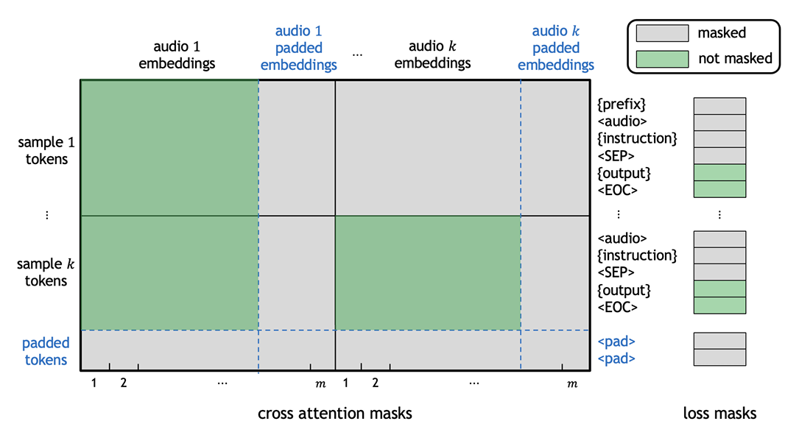

对于由$J$个样本$z\_{\text{int}} = \lbrace z^1, \cdots, z^J \rbrace$组成的交错样本，其中$z^j = (x^j, y^j\_{\text{ins}}, y^j\_{\text{out}})$，对数似然是在所有输出上计算的：

$$
\mathcal{L}_{\text{int}}(z_{\text{int}} = \{z^1, \cdots, z^J\}) = \sum_{j=1}^J \sum_{t=1}^{|y^j_{\text{out}}|} \log P_\theta \left( (y^j_{\text{out}})_t \mid z^{<j}, x^j, y^j_{\text{ins}}, (y^j_{\text{out}})^{<t} \right).
$$

这种交错损失与先前模型不同，先前模型仅在最后一个输出 $y_{\text{out}}^J$ 上计算损失，或者没有将先前的多模态输入 $x^{<j}$ 作为模型预测条件（例如`Flamingo`的交叉注意力仅计算最近的前一个图片）。作者期望上述损失函数可以帮助模型查看**各种数量**(因为<=J的各种数量的上下文样本的情况下的损失都有考虑)的`ICL`样本（包括当 $j = 1$ 时为零）以及相关的音频，从而提高鲁棒性和训练效率，尤其是在检索到类似样本的`ICL`样本时。

#### 整体训练架构

按照惯例，作者将训练分为预训练和监督微调两个阶段。

预训练阶段只训练音频表示变换层和`gated xattn-dense`层，目的是获得这些层的良好初始化权重。监督微调阶段，解冻整个`LM`，并训练所有模块，除了音频编码器。

作者在预训练阶段和监督微调阶段使用了不同的数据集。

其选择依据如下：
1. 数据质量：低质量数据集，包括那些包含低质量或噪声音频、低质量文本和不准确文本标注的数据集用于预训练。
2. 数据多样性：多样性较低或标签分布存在强烈偏差的数据集用于预训练。
3. 数据来源：包含AI生成内容的数据集主要用于预训练，而一些高质量子集可能用于`SFT`。
4. 数据规模：非常大的数据集可以同时用于预训练和`SFT`。
5. `ICL`数据集用于`SFT`阶段。

因此，整体训练目标可以表示为：

其中，$\lbrace D^{i}, i \in J \rbrace$为所有非交错训练数据集，$\lbrace D^{i'}\_{\text{int}}, i' \in J\_{\text{int}} \rbrace$为所有交错训练数据集。整体训练目标是每个数据集损失的加权混合：

$$
L = - \sum_{i \in I} \lambda_i \mathbb{E}_{z \sim D^i} \mathcal{L}(z) - \sum_{i' \in I_{\text{int}}} \lambda_{i'} \mathbb{E}_{z_{\text{int}} \sim D^{i'}_{\text{int}}} \mathcal{L}_{\text{int}}(z_{\text{int}})
$$

每个数据集的权重为$\lambda_i$，是常数超参数，对最终模型有巨大影响。作者根据数据集的大小、质量和多样性，在从不同数据集中采样时分配不同的权重（根据直觉来的）。

#### 多轮对话数据集

为了使模型在处理复杂的多轮对话方面拥有更强的能力，作者使用`GPT-4`生成了两个多轮对话数据集。

作者基于强标签的`AudioSet-SL`和`MusicCaps`构建这些数据集，并使用`LAION-CLAP`嵌入进行阈值过滤以筛选掉不理想的样本。

分别将这两个生成的数据集命名为 `AF-Dialogue-AudioSetSL` 和 `AF-Dialogue-MusicCaps`。

对于多轮对话数据样本，作者构建对话模板如下：

```markdown
<s>The task is dialogue.<audio>
user: {instruction-1}
assistant: <SEP>{output-1}<EOC>
· · ·
user: {instruction-s}
assistant: <SEP>{output-s}<EOC></s>
```

### 未来方向

* 使用更大语言模型。假设更大的LM能拥有更好的知识和更强的遵循指令的能力，那么 `Audio Flamingo` 可以从更大的LM中受益
* 研究转录之外的复杂语音相关任务。这要求模型在更加密集音频嵌入上进行条件化。在 `Audio Flamingo` 中，这种修改很简单，因为其架构足够灵活，可以通过添加新的交叉注意力头来支持新的嵌入
* 构建一个可以输出文本和音频并遵循更复杂交错指令的音频语言模型。
* 将更多模态统一起来。将模型的音频理解能力与视觉语言模型相结合，以便一个模型可以理解图像、视频和音频。

## Audio Flamingo V2[<svg xmlns="http://www.w3.org/2000/svg" enable-background="new 0 0 24 24" height="24px" viewBox="2 -5 24 24" width="24px" fill="#4B77D1"><g><rect fill="none" height="24" width="24"/></g><g><polygon points="6,6 6,8 14.59,8 5,17.59 6.41,19 16,9.41 16,18 18,18 18,6"/></g></svg>](https://arxiv.org/abs/2503.03983)

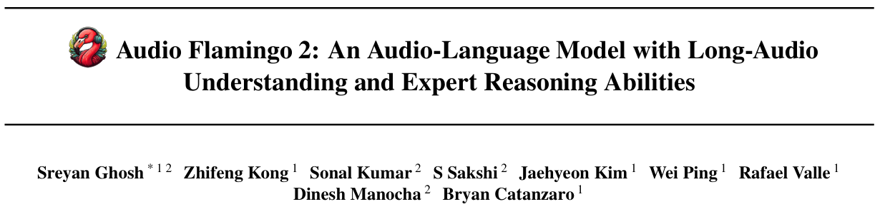

### 概述

*相较于V1变化较大，引入了CLAP和3B参数量的LLM，但是相比Qwen-audio那还是小很多的O(∩_∩)O*

音频语言模型（ALMs）扩展了语言模型的音频理解能力。对比语言-音频预训练（CLAP）是首批**仅使用编码器**的 ALMs 之一，通过对比学习将音频和语言联系起来。在此基础上，后续工作引入了大型 ALMs（LALMs），它们将音频编码器与基于预训练解码器的LLMs集成，实现了开放式的音频问答（AQA）和自由形式的响应生成。

然而，尽管有这些进展，即使是最先进的 LALMs 在专家级推理任务上的表现仍然不如基础任务，如事件分类。例如，Gemini-1.5-Pro这一最先进的模型在 MMAU 声音和音乐子集上仅达到 54.4%和 48.5%，仅仅是评估专家级音频推理的基准，作者将此归因于缺乏高质量的训练数据和稳健的音频表示。

本文中，作者提出 `Audio Flamingo 2`（AF2），一种参数高效的 ALM，结合了 3B 参数的小型解码器 LM 和 203M 参数的音频编码器，实现了最先进的音频理解和推理能力。

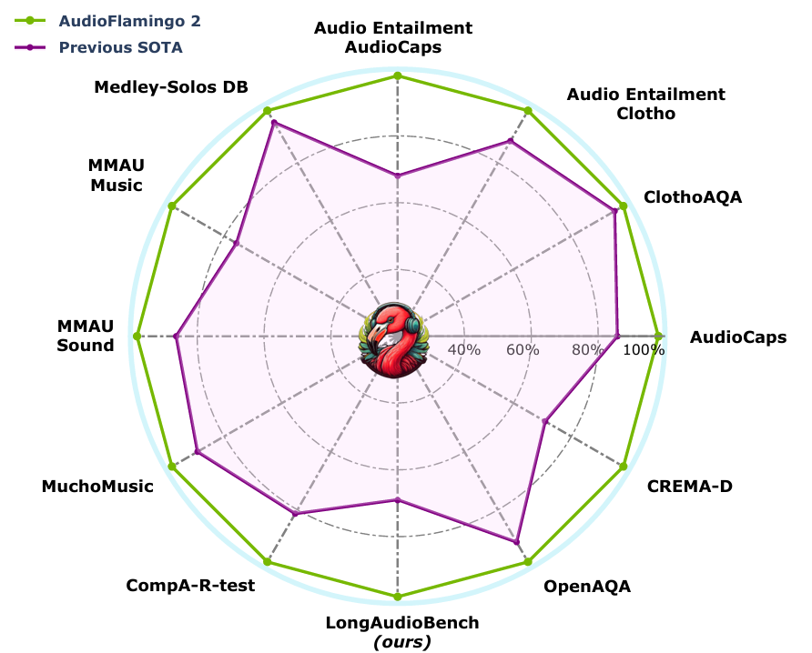

主要创新点： 
1. 数据：近期研究表明，提高数据质量可以与通过扩展计算和模型规模所获得的性能提升相媲美，甚至超过。为此，作者提出了 `AudioSkills`，一个大规模、技能特定的 AQA 训练数据集，包含与每个音频配对的复杂、推理密集型问题。作者设计了针对七个不同技能的问题，主要目的是提高 ALM 的细粒度推理能力。 
2. 音频编码：作者提出了 `AF-CLAP`，将 CLAP 训练扩展到超过 800 万个音频-字幕对，纳入合成数据，并提出了一种改进的对比损失，以获得更好的表示质量和鲁棒性。 
3. 训练策略：作者提出了一种三阶段课程训练策略，以提升性能。
4. 长音频理解：为了使模型能够理解和推理长音频，作者引入了 `LongAudio`，这是一个包含超过 260k 精心挑选的 AQA 实例的新数据集，音频时长从 30 秒到 5 分钟不等。`LongAudio` 涵盖了 10 多个音频类别，支持 6 个任务，包括字幕和 5 个基于推理的问答任务。作者还介绍了 `LongAudioBench`，这是一个用于评估长音频理解中 ALMs 的专家标注基准。

*作者将音频语言模型（ALM） 分为两大类：Encoder-only ALMs 和 Decoder-based ALMs。*

*仅编码器 ALM 是一类多模态语言模型（MLLM），它使用仅编码器 LM 和音频编码器学习音频和语言模态之间的共享空间。典型例子CLAP，一个受启发的开创性基于编码器的 ALM，在音频语言任务（如检索、零样本分类等）上取得了最先进的性能。在此之后，人们尝试通过扩展数据、引入额外的训练目标或使用合成数据来改进 CLAP。其他值得注意的工作包括 Wav2CLIP、AudioClip和 CoLLAT。*

*基于解码器的 ALM：通过结合先进的LLMs， Pengi 这一开创性的基于解码器的 ALM 出现并在各种音频分类任务上实现了 SOTA 结果。 跟随 Pengi，大量大型 ALM 被引入，包括 LTU、LTU-AS、SALMONN、AudioGPT、GAMA、Audio Flamingo等完全开源模型，以及 Qwen-Audio和 Qwen-2-Audio等开放获取模型。大多数进展集中在模型规模和数据集的扩展上，在数据质量或音频编码器表示方面的进步非常有限。这最终转化为在分类和字幕等基础任务上的性能提升，但在专家级推理方面表现不佳，这是向通用人工智能（AGI）迈进所需的能力。*

[项目网站（包含代码和checkpoint）](https://research.nvidia.com/labs/adlr/AF2/)

### 模型架构

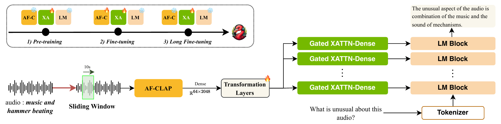

主要包括四个组件：
- AF-CLAP：一种基于 CLAP 的音频编码器，具有滑动窗口特征提取功能
- 音频表示变换层以增加容量
- 仅解码的语言模型
- 用于音频条件化的门控交叉注意力（XATTN-Dense）层

#### AF-CLAP Audio Encoder

CLAP，通过在音频-字幕对上预训练对比损失，展现出强大的音频理解和自然语言对齐能力。作者认为 CLAP 成为构建 ALMs 的合适选择。

但是，由于与 SSL 预训练音频编码器相比性能不足，CLAP 在先前的工作中不太受欢迎。作者认为这是由于高质量音频-字幕对的可获得性有限，导致 CLAP 表示在组合推理和字幕的语言变异方面存在困难。

作者通过**构建一个大规模、高质量的训练数据集**以及**改进训练目标以获得更好的表示鲁棒性**来解决问题并提出 CLAP 的改进版本 AF-CLAP。

##### AF-CLAP Training Dataset

受近期在长视频图像上训练视觉语言模型成功的启发，作者从公开的长视频数据集中收集音频。

作者从 `MiraData` 和 `Video Recap` 中选择了 10 万个多样化的视频，将这些视频分割成 10 秒的片段，并使用 `Qwen2-VL-2B-Instruct` 生成视频字幕，使用 `Qwen2-Audio` 生成音频字幕进行相似度对比。为确保多样性和减少冗余，过滤掉音频-视觉相似度超过阈值的片段 。然后，提示 GPT-4o（2024-05-13）生成以音频为中心的字幕，排除视觉属性并强调声音事件。

通过上述做法，作者将 AF-CLAP 的训练数据集扩展至超过 800 万（10 秒）音频-字幕对。

##### AF-CLAP Training Objective

作者改进了 CLAP 的对比损失，以更好地应对语言变化和组合推理能力

**提高语言不变性**：与 CLAP 类似的模型在泛化到人类容易理解的语言变化方面存在困难。为了解决这个问题，对于数据集中的每个字幕，生成具有相同语义和结构的 M−1 个变化字幕。这些变化字幕以及真实字幕被视为正例。

**提升组合推理**：不同词序或结构的字幕往往传达了声学事件之间的不同关系，例如时间顺序或属性绑定。然而，类似于 CLAP 的模型难以捕捉这些细微差别。为了解决这个问题，引入了组合感知负样本。对于每个正面字幕，我们生成 N 个具有修改后的时间或属性组合的变体，并将它们用作负样本。

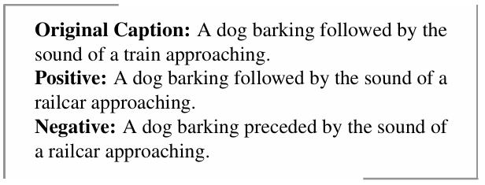

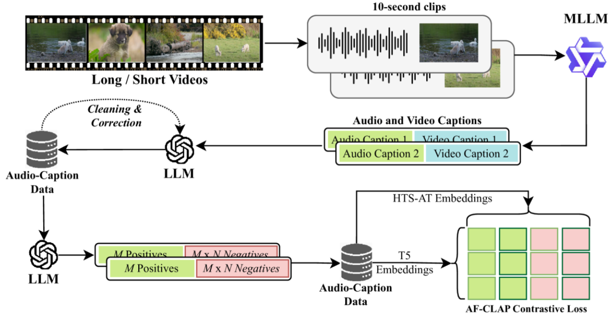

**对比损失**：训练数据中的每个音频样本 $ x $ 现在有 $ M $ 正样本 $\lbrace P(x)\_m \rbrace \_{m=1}^M$ 和 $ M \times N $ 负样本 $\lbrace N(x)\_{m,n} \rbrace \_{m=1, n=1}^{M,N}$。令 $ A(x) $ 为 `HTS-AT large` 音频编码器的音频嵌入，并通过 MLP 投影；令 $ J(x) $ 为 `Flan-T5` 文本编码器的文本嵌入，并通过 MLP 投影。令 $ s(u,v) = \exp(u^Tv / \tau) $ 为具有温度 $ \tau $ 的相似度函数。训练目标是：

$$
\mathcal{L} = -\frac{1}{B} \sum_{i=1}^B \log \frac{S(i,t)}{S_{\text{neg}}(i) + \sum_{j=1}^B S(j,t)},
$$

其中

$$
S(j,t) = \sum_m s(J(P(x_j)_m), A(x_i)),
$$

$$
S_{\text{neg}}(i) = \sum_{m,n} s(J(N(x_i)_{m,n}), A(x_i)),
$$

$ B $是批大小

作者认为改方法鼓励 CLAP 学习语言不变性和组合推理，使其能力更接近人类理解，从而提供更符合人类理解的表示。

#### Audio Conditioning Architecture & LLM

##### Audio Feature Extraction

对于每 10 秒的片段，从 `AF-CLAP` 的倒数第二层提取密集的音频特征 $ h \in \mathbb{R}^{64 \times 2048} $。与最终层的平均池化后的表示相比，这种方法产生的特征质量更高。对于较长的音频，使用**非重叠**滑动窗口来计算和连接音频特征。滑动窗口的最大数量在训练阶段各不相同，在 LongAudio 上训练时最多可达 30 个窗口（5 分钟）。获得滑动窗口特征后使用 RoPE 以 4096 为基数将时间信息编码到特征中。

*批量训练时不足的滑动窗口将被填充，超出的滑动窗口将被裁剪，每个音频生成64m个token，m为窗口数*

##### Representation Transformation Layers 和 Gated Cross-Attention 和V1版本保持一致

##### Frozen Language Model

使用 `Qwen2.5-3B`，一个仅解码的因果LLM模型，拥有 3B 参数，36 个隐藏层和 16 个注意力头。

### 核心算法

#### 训练数据

#### 训练策略
