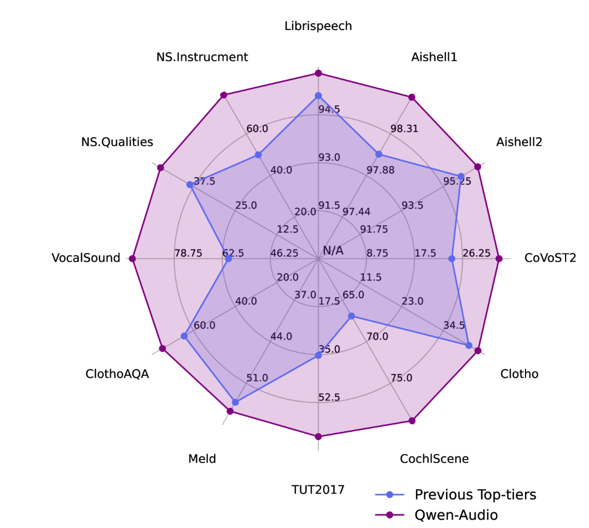
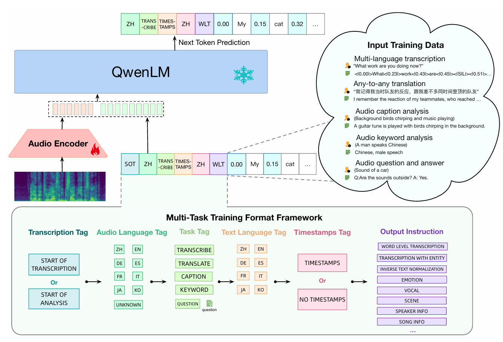
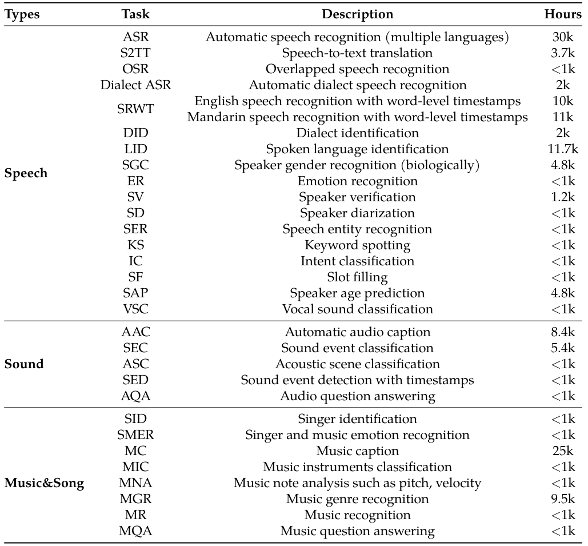
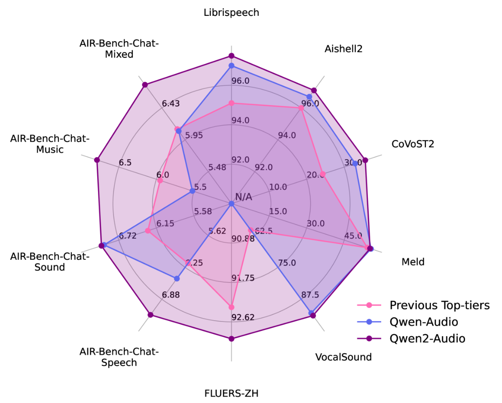
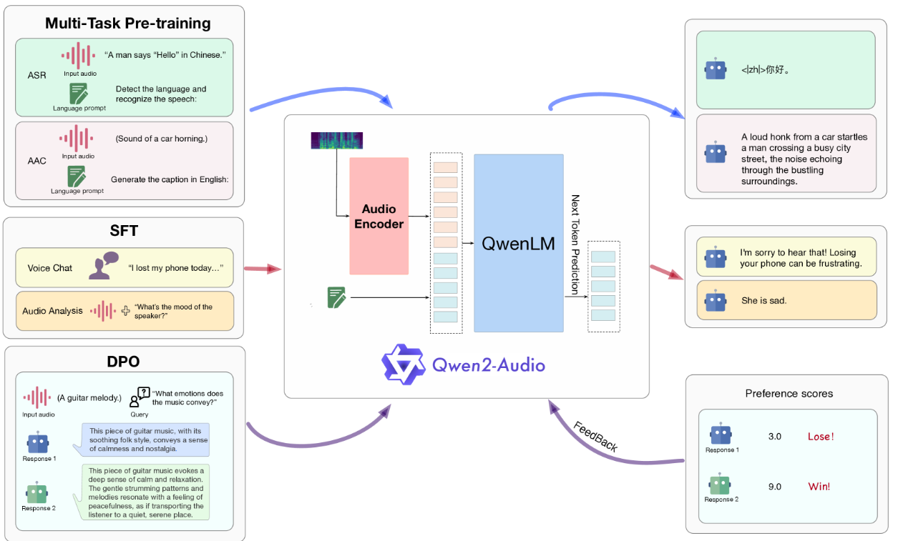

# Qwen-audio V1[<svg xmlns="http://www.w3.org/2000/svg" enable-background="new 0 0 24 24" height="24px" viewBox="2 -5 24 24" width="24px" fill="#4B77D1"><g><rect fill="none" height="24" width="24"/></g><g><polygon points="6,6 6,8 14.59,8 5,17.59 6.41,19 16,9.41 16,18 18,18 18,6"/></g></svg>](https://arxiv.org/abs/2311.07919)

## 概述

跟随指令的音频语言模型在与人类的音频交互方面受到了广泛关注。然而，缺乏能够处理**各种音频类型和任务**的**通用**预训练音频模型。

因此作者团队开发了`Qwen-Audio`模型，并通过**扩展音频语言预训练**来涵盖`30`多项任务和各种音频类型，例如人类语音、自然声音、音乐和歌曲，以促进通用音频理解能力，从而解决这一限制。

但是，直接共同训练所有任务和数据集可能会导致干扰问题，因为由于任务焦点、语言、注释粒度和文本结构的差异，与不同数据集关联的文本标签会表现出相当大的差异。

为了克服一对多的干扰，作者精心设计了一个**多任务训练框架**，通过对解码器的一系列**分层标签**进行调节，以鼓励知识共享并避免通过共享和指定标签的干扰。

`Qwen-Audio`在各种基准测试任务中实现了优异的性能，而无需任何特定于任务的微调(`zero-shot`)。

在·Qwen-Audio·功能的基础上，作者进一步开发了`Qwen-Audio-Chat`(对话指令微调)，它允许来自各种音频和文本输入的输入，支持多轮对话并支持各种音频中心场景。



## 模型架构
- **音频预处理**：重采样为`16kHz`, 使用`25ms`的窗口大小和`10ms`的跳幅将原始波形转换为`80`通道的梅尔频谱图。
- **音频编码器**：`Whisper-large-v2(32层Transformer, 640M参数)`并添加了一个步幅为`2`的`time-dim`池化层，输出帧对应约`40ms`原始音频。
- **大语言模型**：`Qwen-7B(32层Transformer Decoder, 7.7B参数)`，隐藏层维度`4096`。


## 核心算法



### 多任务预训练

*该阶段冻结LLM，仅训练音频编码器*

目前音频处理领域，已经开发了不同的音频数据集来处理特定任务。



`Qwen-Audio`旨在使用**广泛的音频数据集进行联合训练**，目标是训练一个能够**支持所有音频任务的统一模型**。

更重要的是，在共同训练期间，**任务可以相互受益**，因为
1. 类似的任务可以从知识共享和协作学习中受益，因为它们关注对于音频嵌入信息的关注点相似;
2. 依赖于较低级别感知能力的任务可以协助需要更高级别理解或推理能力的任务。

然而，由于任务焦点、语言、注释粒度和文本结构的差异（例如，一些数据是结构化的，而另一些是非结构化的），不同的数据集在文本标签上表现出显著差异。要为不同的任务训练网络，简单地混合这些不同的数据集不能导致相互增强；相反，它会引入干扰。

现有的多任务训练方法要么将相似的任务分组（例如，音频字幕、转录），要么为每个数据集分配一个数据集`ID`以避免干扰。

`Whisper`通过将**任务和条件信息**指定为语言解码器的输入**特殊标记序列**来提出一种多任务训练格式，例如语音活动检测、语言识别和句子级时间戳标签。但是，`Whisper`仅专注于语音翻译和识别任务。

受到`Whisper`的启发，`Qwen-Audio`使用了类似的方法，但为了适应不同的任务，`Qwen-Audio`使用了**不同的标记序列**，从而实现了多任务预训练：
* **转录标签**：预测(文本生成)的开始使用转录标签表示。`<|startoftranscripts|>`用于表示任务涉及准确转录口语和捕获语音记录的语言内容，例如语音识别和语音翻译任务。对于其他任务，将使用`<|startofanalysis|>`标记
* **音频语言标签**：然后，加入一个语言标签，用于指示音频中的口语。此标签使用分配给每种语言（总共八种语言）的唯一令牌。如果音频片段不包含任何语音（如自然声音和音乐），则模型经过训练以预测`<|unknown|>`标记
* **任务标记**：后续标记指定任务。将音频任务分为五类：`<|transcribe|>`、`<|translate|>`、`<|caption|>`、`<|analysis|>`和`<|question-answer|>`任务。对于问答任务，在标签后附加相应的问题。
* **文本语言标记**：标记标记指定输出文本序列的语言。
* **时间戳标签**：`<|timestamps|>`或`<|notimestamps|>`标记决定了模型是否需要预测时间戳。与`Whisper`中使用的句子级时间戳不同，包含`<|timestamps|>`标签要求模型执行精细的单词级时间戳预测，缩写为`SRWT`(peech Recognition with Word-level Timestamps)。这些时间戳的预测与转录词交错：开始时间标记在每个转录标记之前预测，而结束时间标记在每个转录标记之后预测。根据实验，`SRWT`提高了模型将音频信号与时间戳对齐的能力。这种改进的对齐有助于模型全面理解语音信号，从而在许多任务（如语音识别和音频QA任务）中取得显著进步。
* **输出指令**：最后，提供输出指令以进一步指定不同子任务的所需输出格式，然后开始文本输出。

### 监督微调

*该阶段冻结音频编码器，微调LLM*

在上述预训练基础上，采用基于**指令微调**来提高模型与人类意图保持一致的能力，从而产生了一个交互式聊天模型`Qwen-Audio-Chat`。

为了有效地处理多音频对话和多个音频输入，我们引入了用`Audio id:`标记不同音频，其中`id`对应于音频输入对话的顺序。

在对话格式方面，使用`ChatML(Openai)`格式构建我们的指令微调数据集。在这种格式中，每个交互的语句都标有两个特殊标记`<im_start>`和`<im_end>`，以方便对话终止。

```chat_template.
  <im_start>user
  Audio 1: <audio>emov-db/141-168-0155.wav</audio>what does the speaker say?<im_end>
  <im_start>assistant
  The speaker says in English, "Won’t you draw up, gentlemen.".<im_end>
  <im_start>user
  What’s the mood of the person?<im_end>
  <im_start>assistant
  Based on the voice, the mood of the person is disgusted.<im_end>
```

# Qwen-audio V2[<svg xmlns="http://www.w3.org/2000/svg" enable-background="new 0 0 24 24" height="24px" viewBox="2 -5 24 24" width="24px" fill="#4B77D1"><g><rect fill="none" height="24" width="24"/></g><g><polygon points="6,6 6,8 14.59,8 5,17.59 6.41,19 16,9.41 16,18 18,18 18,6"/></g></svg>](https://arxiv.org/abs/2407.10759)

## 概述

与`V1`相比，`V2`不再使用复杂的分层标签相比，而是针对不同的数据和任务使用**自然语言提示(prompt)**，简化了预训练过程，并**进一步扩大了数据量**。

在微调阶段，作者实施了**语音聊天**和**音频分析**两种不同的音频交互模式。在语音聊天模式下，用户无需输入文字，即可自由地与` Qwen2-Audio`进行语音交互；在音频分析模式下，用户可以在交互过程中提供音频和文本指令以供分析。需要注意的是，不需要使用任何系统提示在语音聊天和音频分析模式之间切换。

微调之后，新增第三阶段后训练**DPO(Direct Preference Optimization, 直接偏好优化)**进行偏好训练。



## 模型架构
- **音频预处理**：重采样为`16kHz`, 使用`25ms`的窗口大小和`10ms`的跳幅将原始波形转换为`128`通道的梅尔频谱图。
- **音频编码器**：`Whisper-large-v3`并添加了一个步幅为`2`的`time-dim`池化层，输出帧对应约`40ms`原始音频。
- **大语言模型**：`Qwen-7B`，隐藏层维度`4096`。

`Qwen2-Audio`的总参数为`8.2B`。

## 核心算法



### 多任务预训练

用**自然语言提示**替换V1版本的**分层标签**，如上图所示。实验表明，使用语言提示可以提高更好的泛化能力和更好的指令跟随能力。

### 监督微调

依然在预训练基础上，采用指令微调

将人类的音频方面的交互模式分为两类：
* 音频分析：在音频分析模式下，用户可以灵活地让`Qwen2-Audio`分析各种音频，用户指令可以通过音频或文本给出。
* 语音聊天：在语音聊天模式下，鼓励用户与`Qwen2-Audio`进行语音对话，提出各种各样的问题。

为了模型一致性，两种交互模式是联合训练的，因此用户在使用过程中不会遇到模式差异化，也不需要使用单独的系统提示在不同模式之间切换，这两种模式在实际使用中无缝集成。

### DPO后训练

采用`DPO`来进一步优化模型以遵循人类偏好，DPO优化过程的损失函数如下：

$$
\mathcal{L}_{\text{DPO}}(p_\theta; p_{\text{ref}}) = -\mathbb{E}_{(x,y_w,y_l)\sim\mathcal{D}}\left[
\log\sigma\left(
\beta \underbrace{\log\frac{p_\theta(y_w|x)}{p_{\text{ref}}(y_w|x)}}_{\text{优选响应对数比}}
- \beta \underbrace{\log\frac{p_\theta(y_l|x)}{p_{\text{ref}}(y_l|x)}}_{\text{劣选响应对数比}}
\right)
\right]
$$

* $p_\theta$: 当前策略(模型)
* $p_{\text{ref}}$: 参考策略(模型)（以训练前参数$\theta_{\text{init}}$初始化得到），保持不变
* $(x, y_w, y_l)$: 三元组数据，其中$x$是包含输入音频的输入序列，$y_w$和$y_l$分别是人工注释的好响应和坏响应
* $D$: 三元组数据集
* $\beta$: 温度系数，控制偏离参考策略的程度，超参数
* $\sigma$: sigmoid函数 $\sigma(x) = 1/(1+e^{-x})$
